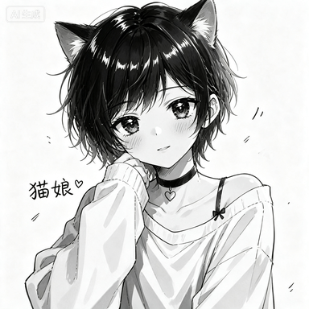

# 猫娘画图



一款以 **APNG 制作与双帧展示**为特色的 AstrBot 多提供商图片生成与编辑插件。

图片生成完成后，插件可以先快速展示猫娘首帧，再揭晓生成结果，并把两帧合成为一张 APNG 动图。内置首帧就是上图，也可以在 WebUI 中上传自己的图片替换。

除了给生成图片增加首帧，还可以直接把 QQ 消息中的多张图片合成为 APNG。插件同时支持 WaveSpeed、RunningHub、兼容 OpenAI Images Generations 格式的服务，以及 AstrBot 中已经配置的提供商，并提供一体化模型管理、预设提示词、生成历史、图片下载、白名单、限流和独立 WebUI 控制台。

## 多图制作 APNG

发送 `apng` 并在同一条消息中附带多张图片，插件会按消息顺序合成 APNG；没有填写间隔时使用 WebUI 的默认值 5 秒。也可以发送 `apng 4`，其中 `4` 表示首帧以外的每帧停留 4 秒。首帧使用 WebUI 设置的默认时长。支持当前消息图片、回复消息中的图片、图片文件，以及 QQ 合并转发聊天记录中的图片。

```text
apng
```

也可以指定循环次数：`apng 4 3` 表示其余帧 4 秒、播放 3 次；循环次数为 `0` 时无限循环。QQ 手机端通常会把 APNG 持续循环播放，可能忽略文件中设置的有限循环次数。使用 `apng 4 --fd 1.5` 可将本次动画的首帧设为 1.5 秒，省略 `--fd` 时使用 WebUI 中的默认首帧时长。默认最低 2 张、最多 20 帧、最大画布边长 2048 像素，都可在 WebUI 修改。最低图片数设为 1 时，只带一张图片会自动在前面补入当前默认首帧；首帧可以是内置图片，也可以通过 WebUI 或 `/nc fs` 设置。不同尺寸的图片会等比缩放、居中，并用白色补齐，不会裁剪。

QQ 合并转发取图依赖 OneBot v11 协议端的 `get_forward_msg` 接口，适用于 aiocqhttp + NapCat 等支持该接口的环境。其他平台或不支持该接口的协议端仍可使用普通消息图片制作 APNG。

## APNG 双帧展示

开启 APNG 包装后的处理顺序：

```text
生成图片 → 猫娘首帧 → 生成结果 → APNG 动图 → 发送
```

WebUI 现在提供两套完全独立的发送设置：

- **生图设置**：控制模型生图的生成中提示、外显金句、合并转发、@ 触发者和双帧首帧包装。
- **APNG 设置**：控制 `apng` 指令成品的外显金句、合并转发、@ 触发者、默认首帧、动画参数、历史上限和完全无痕清理。

两套设置拥有各自的金句列表、金句文件、转发昵称和默认首帧，互相不会覆盖。

生图默认设置：

| 设置 | 默认值 |
| --- | --- |
| 开始生成时发送提示 | 开启 |
| 生图外显金句 | 关闭 |
| 生图合并转发 | 关闭 |
| 发送生图时 @ 触发者 | 关闭 |
| 生图首帧包装 | 关闭 |
| 生图默认首帧 | 插件内置猫娘图片 |
| 生图首帧/结果帧时长 | `100 ms` / `20000 ms` |
| 生图包装循环/压缩 | 无限循环 / 开启 |

APNG 默认设置：

| 设置 | 默认值 |
| --- | --- |
| 生图 / APNG 开始提示 | 开启，`小猫正在搓屏幕中/ᐠ - ˕ -マ Ⳋ📱` |
| APNG 外显金句 | 关闭 |
| APNG 合并转发 | 关闭 |
| 发送 APNG 时 @ 触发者 | 关闭 |
| APNG 默认首帧 | 插件内置猫娘图片 |
| 未指定 `--fd` 时的首帧时长 | `100 ms` |
| 未指定间隔时的默认间隔 | `5 秒` |
| 默认循环次数 | `0`，无限循环 |
| 压缩优化 | 开启 |
| 指令制作最大帧数 | `20` |
| 指令制作最低图片数 | `2` |
| 指令制作最大边长 | `2048 px` |
| 生图 / APNG 完全无痕清理 | 关闭 |
| 生图 / APNG 历史保存上限 | 各 200 条 |

分别进入 WebUI 的“生图设置”和“APNG 设置”即可管理对应行为。任一首帧未上传自定义图片时，都会独立回退到内置 `default_apng_frame.png`。APNG 文件通常比静态图片更大，部分客户端可能只显示其中一帧。

## 主要功能

- 支持文生图和参考图编辑
- 支持 WaveSpeed、RunningHub、OpenAI 兼容接口和 AstrBot 已有模型提供商引用
- 根据消息是否包含图片自动选择文生图或编辑模板
- 支持通过 `--model` 临时指定模型模板
- 支持在提示词中覆盖或增加请求参数
- 支持当前消息图片、回复消息图片和图片文件
- 支持预设提示词和 `{{user_text}}` 占位符
- 支持用户与群组白名单、多时间窗口限流
- 支持生成历史查询、详情查看、删除，以及多张输入原图和生成图的查看、下载
- 历史列表先加载缩略图，点击后才读取完整原图
- APNG 输入原图与 AI 生成历史分开管理，APNG 成品不在服务器留存
- 提供三种 WebUI 主题及响应式布局
- 支持猫娘首帧与生成结果的 APNG 双帧包装
- 支持普通图片、图片外显和 QQ 合并转发

WebUI 的 CSS 根级默认值就是绿色“森林实验室”，即使脚本尚未执行也不会先闪过黄色配色；静态资源带版本标识，插件升级后不会继续误用旧样式。页面右上角可静默切换其他风格，只影响当前打开期间。重新加载和保存并重载使用页面右侧两个独立的圆角图标按钮，竖向排列并与边缘留有间距。手机端提供抽屉式主导航，历史记录会转换为纵向卡片，提供商控制台、配置表单、弹窗及悬浮操作区都会自适应窄屏。

启用生图首帧包装后，临时 APNG 只负责本次消息发送，发送完成即自动清理；生成历史保留包装前的原始生成图。`apng` 指令制作的成品同样始终在发送后清理，独立历史仅保留输入原图。

插件的分层与配置生效流程见 [ARCHITECTURE.md](ARCHITECTURE.md)。

## 模型提供商与默认模型

“模型提供商”是与“生成历史”并列的独立页面，不占用插件配置区域。页面按照 AstrBot 的使用方式采用左右分栏：左侧选择或新增提供商，右侧直接编辑连接、高级配置和模型列表。插件提供商只管理插件自己的 URL 与 Key，不会混入 AstrBot 提供商设置，也不需要手动选择协议。以硅基流动为例，填写 `https://api.siliconflow.cn/v1` 和 API Key，然后点击“获取模型列表”。连接成功后会显示接口返回的模型；搜索框同时过滤已配置模型和待添加模型。只有点击“自定义模型”时才允许手工填写模型 ID。选择模型后，可以继续设置用途（文生图或图片编辑）、显示名称、参考图字段、回退优先级和请求参数。

插件会根据 URL 自动识别 WaveSpeed、RunningHub 或 OpenAI 兼容协议；无法识别的地址默认按 OpenAI 兼容处理。只有地址中明确包含 `wavespeed` 时才会把模型 ID 拼接到请求路径，普通的 `/api/v3` 不再作为判断依据。WaveSpeed 不提供通用模型搜索，需通过“自定义模型”填写；RunningHub 使用自己的任务提交和轮询流程。模型自定义参数能力保持不变。

“默认模型选择”与提供商配置分离，包含“默认文生图模型”和“默认图片编辑模型”两个下拉框。两个下拉框都可以选择“无”；选择“无”时对应类型不会自动回退到其他模型。下拉框同时列出猫娘画图中已启用的对应用途模型，以及 AstrBot 当前已启用的模型。保存后模型客户端立即刷新，不需要再重启插件。

旧版的“模型提供商 + 模型模板”配置会在首次启动时自动合并迁移。旧版 AstrBot 引用不会出现在插件提供商列表中；如需复用 AstrBot 模型，直接在“默认模型选择”中选择。

## 内置模型

| 模型提供商 | 用途 | 内置模型 |
| --- | --- | --- |
| WaveSpeed 文生图 | 使用 WaveSpeed API 生成图片 | `bytedance/seedream-v5.0-pro` |
| WaveSpeed 图片编辑 | 使用 WaveSpeed API 编辑参考图 | `bytedance/seedream-v5.0-pro/edit` |
| RunningHub 文生图 | 使用 RunningHub API 生成图片 | `seedream-v5-lite/text-to-image` |
| RunningHub 图片编辑 | 使用 RunningHub API 编辑参考图 | `dola-Seedream-5.0-pro/image-to-image` |
| OpenAI | 调用兼容 Images Generations 格式的接口 | `gpt-image-2` |

首次升级时，原有模型会跟随对应提供商迁入同一张卡片。模型名称、用途、参考图字段和请求参数均可在 WebUI 中修改。

> OpenAI 兼容模型调用图片生成接口。兼容服务需要支持 Bearer Token 和 JSON 请求；插件可读取 `data[].url`、`data[].b64_json` 以及 SiliconFlow 使用的 `images[].url` 响应。不同服务的实际兼容程度可能不同。

## 环境要求

- AstrBot `4.24.1` 或更高版本
- 使用 AI 绘图时需要至少一组可用的提供商 API 凭据；只制作 APNG 时不需要

## 安装

插件标识为 `astrbot_plugin_neko_draw`。

可以通过 AstrBot 插件管理页面上传插件压缩包，或将插件目录放入：

```text
AstrBot/data/plugins/
```

安装后，在插件管理页面启用或重载“猫娘画图”。插件发布到 AstrBot 插件市场后，也可以直接从市场安装。

## 模型提供商

进入插件 WebUI 的独立“模型提供商”页面添加和管理 API 凭据。可以添加多个提供商，例如 OpenAI 官方接口、兼容中转服务和另一组备用账号。插件按 URL 自动识别调用方式；连接测试不会提交图片生成任务。

| 字段 | 说明 |
| --- | --- |
| 提供商 ID | 插件内唯一的连接名称 |
| API Key | 该提供商使用的访问密钥 |
| API Base URL | 该提供商的接口根地址；填写后自动识别调用协议 |
| 超时时间、代理、自定义请求头 | 只作用于当前提供商 |

首次安装时模型提供商和默认模型均为空，不会自动建立 WaveSpeed、RunningHub 或 OpenAI 项。请根据实际使用的服务自行新增；升级用户原来保存的提供商与模型会继续迁移和保留。

API Key 属于敏感信息，请勿截图、公开或提交到代码仓库。

每个提供商下直接管理自己的图片模型。AstrBot 已有模型不会混入此页面，只会作为候选项出现在“默认模型选择”中；由于聊天模型提供商不一定支持图片生成，选择前仍需确认对应端点能力。

## 图片模型

每个模型代表一套可以独立调用的图片生成配置，并直接归属于当前提供商。WebUI 会根据模型 ID 和提供商地址显示可用的推荐参数，但不会自动写入；只有主动点击“添加推荐参数”后才会补充尚未设置的字段，已有人工参数不会被覆盖。所有参数仍可自由增加、删除或修改。

| 字段 | 说明 |
| --- | --- |
| 显示名称 | 供默认模型和 `--model` 参数引用，必须全局唯一 |
| 模型 ID | 从服务商返回列表选择；仅自定义模型可手工填写 |
| 模型用途 | 文生图或图片编辑 |
| 启用模型 | 控制模型是否可用 |
| 允许作为默认模型 | 控制模型是否参与默认模型选择 |
| 默认回退优先级 | 指定的默认模板不存在、被停用或不适合当前模式时生效；数字越小优先级越高 |
| 参考图字段名 | 编辑模型使用的请求字段；文生图留空 |
| 参考图数量上限 | 单次请求允许使用的参考图数量 |
| 提示词最小长度 | 提交前的提示词长度限制 |
| 请求参数 | 发送给模型接口的附加参数 |

提供商 ID、模型显示名称和预设触发词都必须唯一。

不同模型接受的参数可能不同，请以对应提供商当前的模型接口文档为准。

## 基本使用

| 命令 | 说明 |
| --- | --- |
| `nd <提示词>` | 生成图片；消息包含参考图时自动选择编辑模板 |
| `nde <提示词>` | 使用默认编辑模板处理参考图 |
| `apng [间隔秒数] [循环次数] [--fd 首帧秒数]` | 将随消息发送的图片制作成 APNG；省略间隔时默认 5 秒 |
| `--model <模板名>` | 临时指定模型模板 |
| `--参数名 <值>` | 覆盖模板参数或增加新参数 |

文生图示例：

```text
nd 黄昏海边，海浪拍打礁石，电影感写实摄影 --aspect_ratio 16:9 --resolution 2k
```

图片编辑示例：

```text
nde 把图片中的人物改成赛博朋克风格
```

图片编辑需要随消息发送图片，或者回复一条包含图片的消息。

指定 RunningHub 模板：

```text
nd 像素风角色 --model rh_seedream_lite
```

最终请求参数按“内置推荐值 → 当前模型保存值 → QQ 指令临时参数”的顺序合并，同名项以后者为准。参数值会进行基础类型转换：

- `true`、`false` 转换为布尔值
- 数字文本转换为数字
- 无值参数视为 `true`
- 其他内容保留为文本

## 预设提示词

预设提示词可以在 WebUI 中添加和修改，也可以通过管理员命令维护。

| 命令 | 说明 |
| --- | --- |
| `/nc pa <触发词> <提示词内容>` | 添加或更新预设 |
| `/nc pd <触发词>` | 删除预设 |
| `/nc pl` | 查看预设触发词 |
| `/nc ps <触发词>` | 查看预设详情 |

预设内容可以使用 `{{user_text}}`，调用时会替换为用户输入。预设还可以配置固定参考图，并决定它位于用户图片之前或之后。

## 白名单

白名单默认关闭。启用后，只有指定用户或群组可以使用绘图功能。

| 命令 | 说明 |
| --- | --- |
| `/nc wa <u或g> <ID>` | 添加用户（u）或群组（g）白名单 |
| `/nc wd <u或g> <ID>` | 删除用户（u）或群组（g）白名单 |
| `/nc wl` | 查看白名单 |

白名单和预设管理命令仅限 AstrBot 管理员使用。

## 生成历史

WebUI 会记录成功和失败的生成任务，包括用户、群组、提示词、模板、提供商、模型、请求参数、参考图数量、生成耗时、状态和错误信息。

成功生成的多张图片和本次使用的多张输入原图都可以在历史详情中查看、逐张下载。列表和详情先加载缩略图，点击后才读取完整原图。历史记录支持筛选、分页、单条删除、全部清空和保存上限。

图片编辑任务会将实际提交给模型的原图复制到插件数据目录。删除记录、清空历史或超出上限时，该记录的数据库信息、输入原图、生成图和全部缩略图都会一起删除。开启“生图完全无痕清理”后，本次请求不会留下记录或插件托管文件。

## APNG 文件与清理

`apng` 指令制作的动画成品只用于本次发送，发送完成后始终从服务器删除。独立的“APNG 作品”页面只保存并展示制作时的输入原图副本，支持多图缩略图、按需查看原图、逐条删除和全部清空。

如果开启“APNG 完全无痕清理”，插件还会跳过历史写入，不保留输入原图副本或缩略图。生图也有独立的完全无痕开关。两类历史可分别设置保存上限，超出的最旧记录会连同全部插件托管文件一起删除；设为 0 表示不保留对应历史。

## 输出设置

猫娘画图支持普通图片消息、@ 触发者、APNG 动图包装、图片外显文案和 QQ 合并转发消息。

APNG 默认关闭；开启后使用内置猫娘首帧，也可以上传自定义首帧。第一帧、第二帧停留时间，循环次数和压缩优化均可独立设置。

管理员也可以直接在 QQ 中管理首帧和包装开关：

| 指令 | 说明 |
| --- | --- |
| `/nc fs` + 图片 | 使用随消息发送或回复的最后一张图片设置首帧 |
| `/nc fv` | 查看当前首帧 |
| `/nc fr` | 恢复插件内置首帧 |
| `/nc ao` | 开启生成图片的 APNG 首帧包装 |
| `/nc af` | 关闭生成图片的 APNG 首帧包装 |

发送 `/nc h` 可以查看完整的字母缩写指令帮助。

图片外显和合并转发依赖 `aiocqhttp` 平台。其他平台不支持时会自动回退为普通图片。

## 限流与网络

插件支持单用户多时间窗口限流、限流白名单、最大并发任务数、WaveSpeed 429 指数退避重试、请求代理、轮询间隔和任务超时。

不同账户和服务套餐的并发额度可能不同，请根据提供商控制台显示的实际额度设置最大并发数。

## 数据存储

生成图片、历史记录、预设提示词和白名单保存在 AstrBot 分配的插件数据目录中。更新插件时不应删除该目录；卸载或清理数据前，请先备份需要保留的内容。

## 注意事项

- 图片生成可能产生第三方 API 费用
- 模型名称、参数、价格和可用性可能由提供商调整
- RunningHub 不同模型接口使用的参数名称可能不同
- 文生图模板收到图片时会忽略参考图
- 编辑模板没有收到参考图时会提示用户补充图片
- 参考图会在提交前转换为提供商支持的 URL 或 Data URI
- 请确保生成内容符合所使用平台的服务条款和当地法律法规

## 许可证

本项目采用 MIT License。
